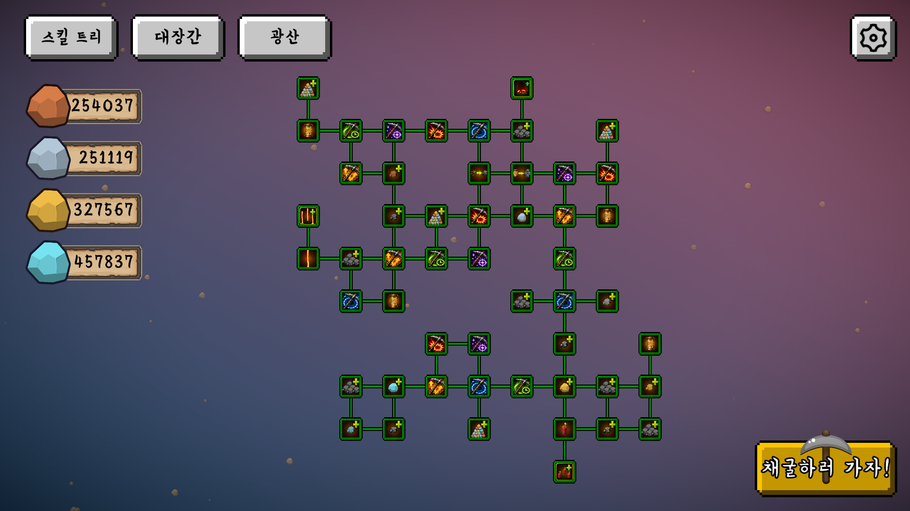
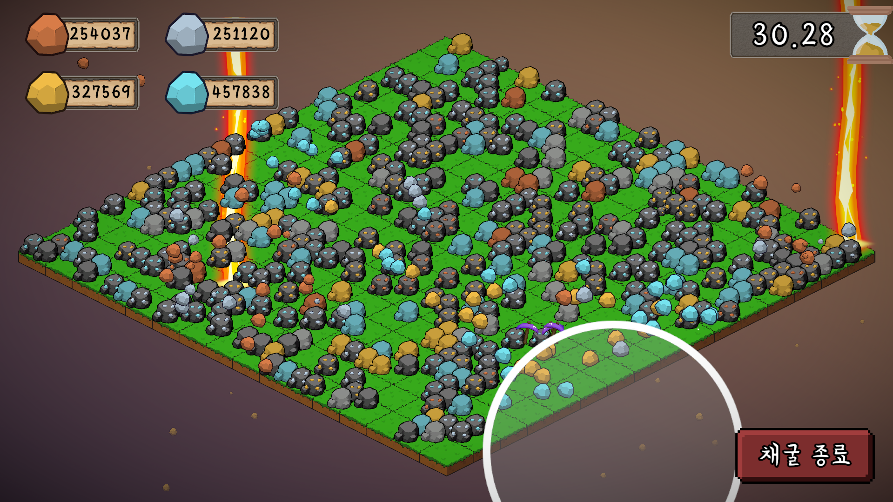

<!-- HERO (centered only at the top) -->
<h1 align="center">MineRush</h1>
<p align="center"><em>Keep on Mining 모작 게임 (2D 방치형 채굴 성장 게임)</em></p>


<p align="center">
  <a href="https://www.youtube.com/watch?v=g8p18phqylE">
    
  </a>
</p>

<table>
  <tr>
    <td></td>
    <td></td>
    <td></td>
  </tr>
</table>


---

## About the Game

**MineRush**는 모바일 게임 **Keep on Mining**을 참고하여 제작한 2D 채굴 성장형 모작 게임입니다.

플레이어는 제한 시간 동안 광석 필드에서 돌을 채굴해 자원을 획득하고, 획득한 광물로 곡괭이와 강화 노드를 성장시킵니다.  
채굴 세션을 반복할수록 더 높은 등급의 광석이 등장하고, 자동 채굴과 스킬 효과를 통해 더 빠르게 자원을 모으는 것이 핵심 목표입니다.

## Features

- **채굴 세션 시스템**: 정해진 시간 동안 광석을 채굴하고 결과 화면에서 획득 자원을 확인
- **마우스 기반 채굴**: 커서 위치를 기준으로 채굴 범위를 표시하고, 채굴 속도에 따라 자동으로 타격
- **곡괭이 강화**: 나무, 구리, 철, 금, 다이아, 전설 곡괭이로 성장하며 채굴 능력 증가
- **광물 수집 구조**: 구리, 철, 금, 다이아몬드 등 다양한 광물을 획득하고 업그레이드 재화로 사용
- **노드 강화 시스템**: 채굴력, 채굴 속도, 채굴 범위, 치명타, 보상 배율, 광석 등장 확률 등을 강화
- **자동 채굴 시스템**: 시간이 지나면 누적 보상을 획득할 수 있는 자동 채굴 기능 구현
- **스킬형 업그레이드**: 채굴 중 광석 추가 생성, 레이저, 폭탄 등 특수 효과 발동
- **저장 시스템**: 보유 광물, 업그레이드 레벨, 튜토리얼 진행도, 오디오 설정 저장
- **사운드/연출 피드백**: 채굴, 광석 파괴, 획득, 업그레이드, 세션 시작/종료 효과음 적용 
## Progression

- **곡괭이 강화**: 광물을 소모해 더 높은 티어의 곡괭이를 해금하고 채굴력, 속도, 범위를 강화
- **자동 채굴**: 자동 채굴 레벨을 올려 접속 시간과 별개로 누적 보상을 획득
- **노드 강화**: 강화 노드를 구매해 세션 시간, 보상 배율, 치명타, 광석 등장 확률 등 성장 방향 선택
- **게임 루프**: 채굴 세션 진입 → 광석 채굴 → 보상 획득 → 업그레이드 → 더 높은 효율의 채굴 세션 반복 

## Project Structure

```text
Assets/Scripts
├── AutoMining      # 자동 채굴 보상 계산 및 UI 제어
├── Datas           # 광물, 돌, 곡괭이, 저장 데이터 ScriptableObject/DTO
├── DBs             # Resources 데이터 로드용 DB 클래스
├── Forge           # 곡괭이 구매/강화 처리
├── GameLoop        # 채굴 세션, 돌 생성, 채굴 입력, 스킬 연출, 오브젝트 풀링
├── Managers        # 게임, 저장, 오디오, 광물, 업그레이드, 스킬 매니저
├── Scenes          # Main/Upgrade/GameLoop 씬 전환 로직
├── UIs             # 메인 UI, 게임 루프 UI, 곡괭이 UI, 업그레이드 UI
└── UpgradeSys      # 업그레이드 데이터, 런타임 스탯 계산, 노드/스킬 시스템
```
 